                                       网络安全实验报告     AES加密算法的实现
#### 　　　　　　　　　　　　　　　　　　　　　　　　　　翟宏佳 电信钱61 2160405066
#### 　　　　　　　　　　　　　　　　　　　　　　　　　　　　　　　　　[实验项目链接](https://github.com/zhaihongjia/Network-Security-homework)

### 1.AES介绍

​        AES（高级加密标准，Advanced Encryption Standard）是一个新的可以用于保护电子数据的加密算法。AES 是一个迭代的、对称密钥分组的密码，它可以使用128、192 和 256 位密钥，并且用 128 位（16字节）分组加密和解密数据。与公共密钥密码使用密钥对不同，对称密钥密码使用相同的密钥加密和解密数据。通过分组密码返回的加密数据的位数与输入数据相同。迭代加密使用一个循环结构，在该循环中重复置换和替换输入数据。

​      AES，在密码学中又称Rijndael加密法，是美国联邦政府采用的一种分组加密标准。这个标准用来替代原先的 DES，目前已经广为全世界所使用，成为对称密钥算法中最流行的算法之一。其加密流程如下所示：

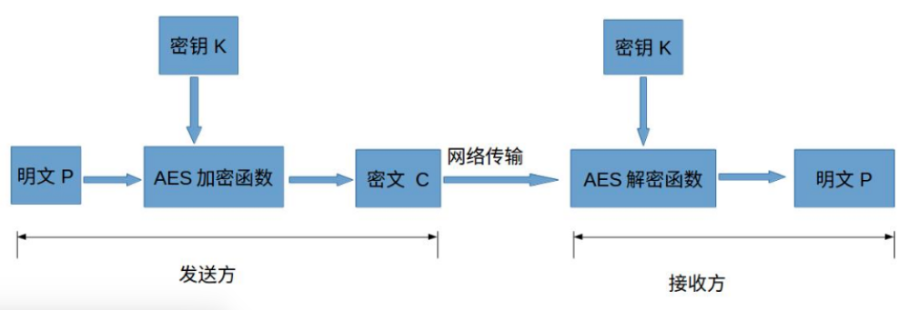

明文P：没有经过加密的数据。

密钥K：用来加密明文的密码，在对称加密算法中，加密与解密的密钥是相同的。密钥为接收方与发送方协商产生，但不可以直接在网络上传输，否则会导致密钥泄漏，通常是通过非对称加密算法加密密钥，然后再通过网络传输给对方，或者直接面对面商量密钥。密钥是绝对不可以泄漏的，否则会被攻击者还原密文，窃取机密数据。

AES加密函数：设AES加密函数为E，则 C = E(K, P),其中P为明文，K为密钥，C为密文。把明文P和密钥K作为加密函数的参数输入，则加密函数E会输出密文C。

密文C：经加密函数处理后的数据

AES解密函数：设AES解密函数为D，则 P = D(K, C),其中C为密文，K为密钥，P为明文。把密文C和密钥K作为解密函数的参数输入，则解密函数会输出明文P。

### 2.AES算法原理

　　AES算法（即 Rijndael 算法）是一个对称分组密码算法。数据分组长度必须是 128 bits，使用的密钥长度为 128，192 或 256 bits。对于三种不同密钥长度的 AES 算法，分别称为“AES-128”、“AES-192”、“AES-256”。

下图是 AES 加密解密的整体流程图：

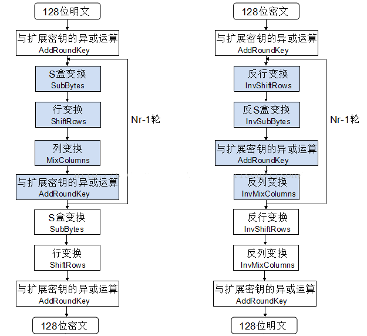

3个符号说明：`Nb`—— 状态 State 包含的列（32-bit 字）的个数，也就是说 Nb=4；`Nk`—— 密钥包含的 32-bit 字的个数，也就是说 Nk=4，6 或 8；`Nr`—— 加密的轮数，对于不同密钥长度，轮数不一样。

AES算法主要分为三个方面：密钥扩展、分组加密、分组解密。

#### 1.密钥扩展

　　AES 算法通过密钥扩展程序（Key Expansion）将用户输入的密钥 K 扩展生成 `Nb(Nr+1)`个字，存放在一个线性数组`w[Nb*(Nr+1)]`中。

- 位置变换函数`RotWord()`，接受一个字 [a0, a1, a2, a3] 作为输入，循环左移一个字节后输出 [a1, a2, a3, a0]。

- S盒变换函数`SubWord()`，接受一个字 [a0, a1, a2, a3] 作为输入。S盒是一个16x16的表，其中每一个元素是一个字节。对于输入的每一个字节，前四位组成十六进制数 x 作为行号，后四位组成的十六进制数 y
  作为列号，查找表中对应的值。最后函数输出 4 个新字节组成的 32-bit 字。

- 轮常数`Rcon[]`，直接把它当做常量数组。

- 扩展密钥数组`w[]`的前 `Nk` 个元素就是外部密钥 K，以后的元素`w[i]`等于它前一个元素`w[i-1]`与前第 Nk 个元素`w[i-Nk]`的异或，即`w[i] = w[i-1] XOR w[i-Nk]`；但若 i 为 `Nk` 的倍数，则`w[i] = w[i-Nk] XOR SubWord(RotWord(w[i-1])) XOR Rcon[i/Nk-1]`。

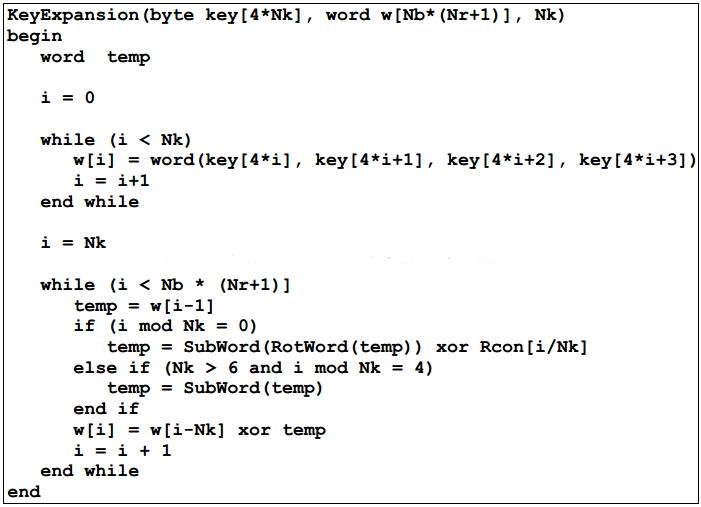

#### 2.分组加密

　　根据 AES 加密的整体流程图，其伪代码流程框架如下：

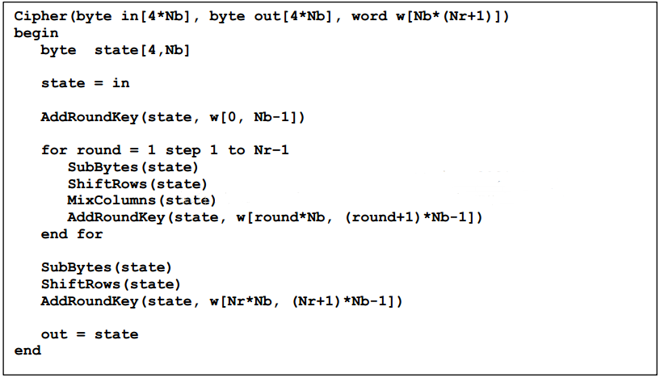

　　AES 加密时涉及到的子程序有`SubBytes()`、`ShiftRows()`、`MixColumns()`和`AddRoundKey()`。

- S盒变换-SubBytes()

  S盒是一个 16 行 16 列的表，表中每个元素都是一个字节。S盒变换很简单：函数SubBytes()接受一个 4x4 的字节矩阵作为输入，对其中的每个字节，前四位组成十六进制数 x 作为行号，后四位组成的十六进制数 y 作为列号，查找表中对应的值替换原来位置上的字节。

- 行变换-ShiftRows()

  行变换也很简单，它仅仅是将矩阵的每一行以字节为单位循环移位：第一行不变，第二行左移一位，第三行左移两位，第四行左移三位。如下图所示：

  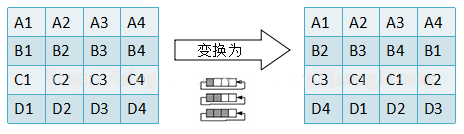

- 列变换-MixColumns()

  函数`MixColumns()`同样接受一个 4x4 的字节矩阵作为输入，并对矩阵进行逐列变换，变换方式如下：变换中采用的乘法是伽罗华域上面的乘法。

  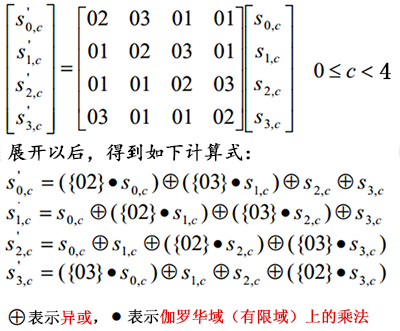

  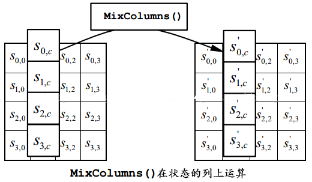

- 与扩展密钥的异或-AddRoundKey()

  根据当前加密的轮数，用`w[]`中的 4 个扩展密钥与矩阵的 4 个列进行按位异或。如下图所示：

  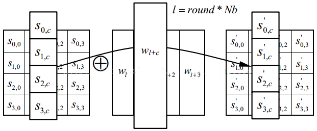

#### 3.分组解密

　　根据 AES 解密的整体流程图，可以得出伪代码如下：

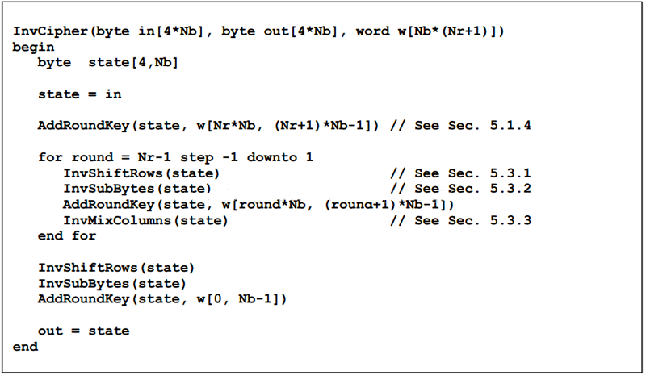

　　从伪代码可以看出，解密部分需要分别实现 S 盒变换、行变换和列变换的逆变换`InvShiftRows()`、　　`InvSubBytes()`和`InvMixColumns()`。

- 逆行变换-InvShiftRows()

  上面讲到`ShiftRows()`是对矩阵的每一行进行循环左移，所以`InvShiftRows()`是对矩阵每一行进行循环右移。

  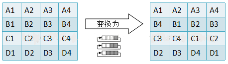

- 逆Ｓ盒变换-InvSubBytes()

  与 S 盒变换一样，也是查表，查表的方式也一样，只不过查的是另外一个置换表（S-Box的逆表）。

- 逆列变换-InvMixColumns()

  与列变换的方式一样，只不过计算公式的系数矩阵发生了变化。如下图：

  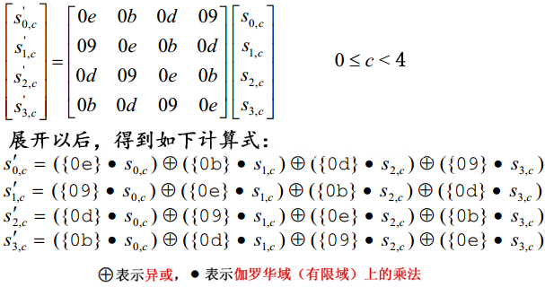

### 3.实验演示结果：

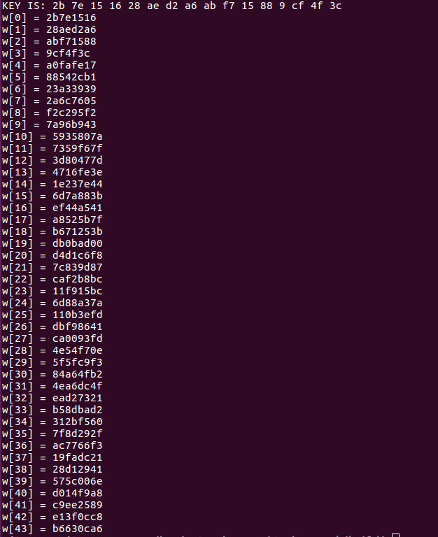

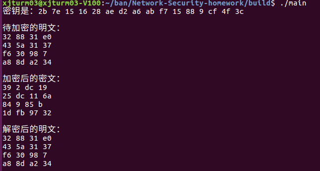